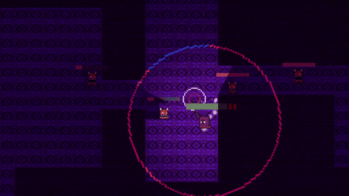
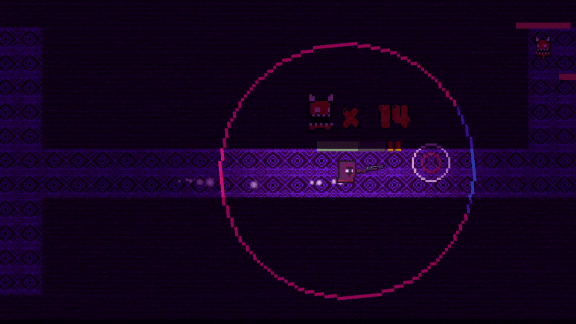
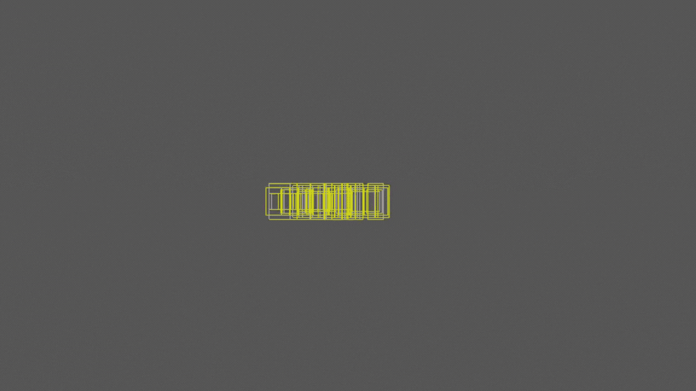
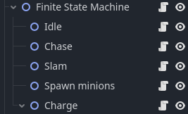
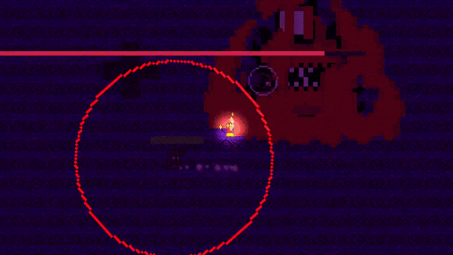

This is a Game Development Project made using Godot. It's a 2D dungeon shooter game much like soul knight and other roguelike dungeon crawler games.

# Gameplay Preview

This game introduces a new experimental mechanic where the player has to grab the falling bullet after it runs out. The gun can then be reloaded when the player picks up the bullet.

# Implementations
Some implementations made during the development of this game that are worth mentioning are as follows:

- ## Pathfinding
The pathfinding utilizes the built-in node in Godot called NavigationAgent2D, which allows the Enemy AI to traverse the navigable areas.\
The enemy also has a detection range and will begin chasing the player once they enter it.

- **References**:
  - [enemy detection](https://www.youtube.com/watch?v=lNADi7kTDJ4)

  - [pathfinding](https://www.youtube.com/watch?v=Lt9YdQ6Ztm4)

- ## Procedural Generation
The map in this game was generated using Procedural Generation. It works by spawning RigidBodies, which react physically when they overlap, causing them to disperse randomly. These RigidBodies are then connected into a tree-like structure using a Minimum Spanning Tree (MST).

Learn more about the implementation 
[here.](https://www.youtube.com/watch?v=G2_SGhmdYFo&list=PLsk-HSGFjnaH82Bn6xbQNehatj3sIvtMQ&index=7)

- ## Finite State Machine
The bossfight section of this game was handled using Finite State Machine. FSM allows for easier state management, making Boss AI a breeze to develop.

Reference to how it was made
[here.](https://www.youtube.com/watch?v=otHfaomtJh0)

# Credits
- [Audio Atribution](./path-to-your-file.txt)
- [Characters](https://0x72.itch.io/dungeontileset-ii)
- [UI](https://pixelfrog-assets.itch.io/tiny-swords)
- Effects:
  - [Effect 1](https://bdragon1727.itch.io/free-smoke-fx-pixel-2)
  - [Effect 2](https://bdragon1727.itch.io/free-effect-bullet-impact-explosion-32x32)
  - [Effect 3](https://bdragon1727.itch.io/free-effect-and-bullet-16x16)
  - [Effect 4](https://bdragon1727.itch.io/retro-impact-effect-pack-all)
